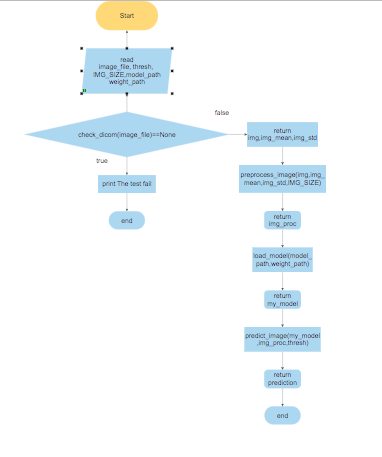
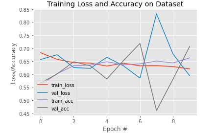
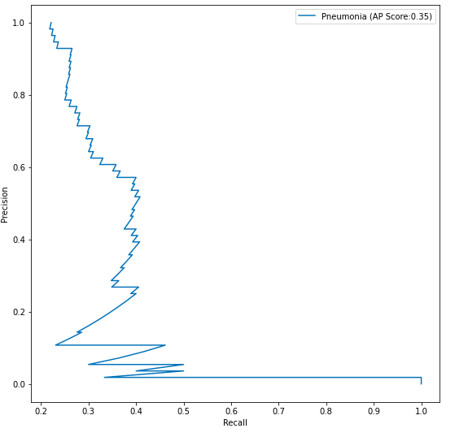
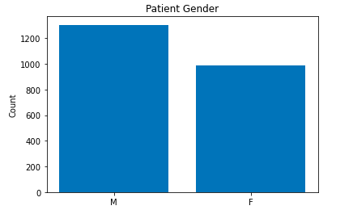
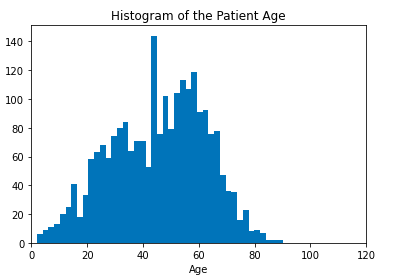
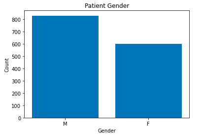
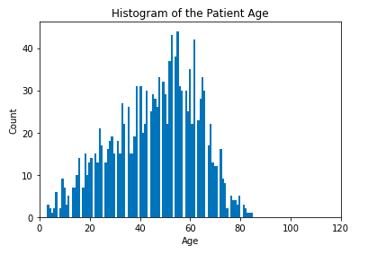

# FDA  Submission

**Claudia Perez Ruisanchez:**

**Pneumonia Assistant Classifier:**

## Algorithm Description

### 1. General Information

**Intended Use Statement:**

For assisting the radiologist into Pneumonia detection on chest x-rays.

**Indications for Use:**

* Use in chest x-rays screenings studies
* Use in women and men with ages between 10 and 78 years.

**Device Limitations:**

* Slow performance without GPU
* The algorithm is not tested for patients with previous history of Pneumonia.

**Clinical Impact of Performance:**

Since the algorithm is designed for screening studies we set our threshold in function of maximizing the recall. This is due to the  FP doesn’t have a bit impact on a patient and we are more interested in reduce the FN.

### 2. Algorithm Design and Function

**DICOM Checking Steps:**

We create a function that reads in a .dcm file, checks the important fields for our device such as:
* check if the image type is 'DX'
* check if the body part is 'CHEST'
* check if the image position is 'AP' or 'PA'

and returns a numpy array with the imaging data its mean and its standard deviation is all the conditions above holds.

**Preprocessing Steps:**

We standarize  the image and after  we resize the image.

**CNN Architecture:**

We use the VGG16 CNN with all its layers freezed with the exception of the last convolutional layers on which we did fine tunning with loss='binary_crossentropy', optimizer='adam' and metrics=['binary_accuracy']. We also ad a flatten layer and the output dense layer.

### 3. Algorithm Training

**Parameters:**
* Types of augmentation used during training
          horizontal_flip = True,
          height_shift_range= 0.1,
          width_shift_range=0.1,
          rotation_range=20,
          shear_range = 0.1,
          zoom_range=0.1
* Batch size= 64
* Optimizer Adam with learning rate 1e-4
* Layers of pre-existing architecture that were frozen

        input_1 (InputLayer)         (None, 224, 224, 3)       0         
        block1_conv1 (Conv2D)        (None, 224, 224, 64)      1792      
        block1_conv2 (Conv2D)        (None, 224, 224, 64)      36928     
        block1_pool (MaxPooling2D)   (None, 112, 112, 64)      0        
        block2_conv1 (Conv2D)        (None, 112, 112, 128)     73856     
        block2_conv2 (Conv2D)        (None, 112, 112, 128)     147584    
        block2_pool (MaxPooling2D)   (None, 56, 56, 128)       0         
        block3_conv1 (Conv2D)        (None, 56, 56, 256)       295168    
        block3_conv2 (Conv2D)        (None, 56, 56, 256)       590080    
        block3_conv3 (Conv2D)        (None, 56, 56, 256)       590080    
        block3_pool (MaxPooling2D)   (None, 28, 28, 256)       0         
        block4_conv1 (Conv2D)        (None, 28, 28, 512)       1180160   
        block4_conv2 (Conv2D)        (None, 28, 28, 512)       2359808   
        block4_conv3 (Conv2D)        (None, 28, 28, 512)       2359808   
        block4_pool (MaxPooling2D)   (None, 14, 14, 512)       0         
        block5_conv1 (Conv2D)        (None, 14, 14, 512)       2359808   
        block5_conv2 (Conv2D)        (None, 14, 14, 512)       2359808

* Layers of pre-existing architecture that were fine-tuned

        block5_conv3 (Conv2D)        (None, 14, 14, 512)       2359808   
        block5_pool (MaxPooling2D)   (None, 7, 7, 512)         0    
* Layers added to pre-existing architecture

         Flatten()
         Dense(1, activation='sigmoid')

**Final Threshold and Explanation:**

We decide to use a threshold of 0.39 since was the value obtained for a value of recall of 0.7. We want to have a high recall even penalizing the precision since our algorithm is developed for screening studies and we want to take into account the false negatives.

### 4. Databases

**Description of Training Dataset:**

 We have 2290 rows in our training dataset with 27 features. The pneumonia_class is balanced with 50 percent of the data of patients with pneumonia. The gender in slightly imbalanced as we can see as follows, with more males than females:

 

 The distribution of the ages is as follows with more cases between 10 and 78 years:

 

**Description of Validation Dataset:**

We have 1430 rows in our training dataset with 27 features. The pneumonia_class is imbalanced with 80 percent of the data of patients with pneumonia. The gender in slightly imbalanced as we can see as follows, with more males than females:

The distribution of the ages is as follows with more cases between 10 and 78 years:

### 5. Ground Truth

 We used the NIH Chest X-ray Dataset, this dataset is highly imbalanced in relation with the patients with pneumonia. NLP-derived labels from the NIH are sub-optimal since they are more general than only the case of Pneumonia, one patient can have more than one disease similar to Pneumonia and many of the with more prevalence in the dataset than Pneumonia. This could impact the algorithm clinical performance.

### 6. FDA Validation Plan

**Patient Population Description for FDA Validation Dataset:**

 We want to make sure that the population used for the dataset are women and men with ages between 10 and 78 years with no history of previous Pneumonia disease. We also want an image type of "DX" and the only body part examined is the chest
 imaging modality, body parts examined, age range, gender distribution, prevalence of pneumonia (and other diseases)

**Ground Truth Acquisition Methodology:**

As the Ground Truth we will use the silver standard approach of using several radiologists since identifying Pneumonia is difficult for radiologists.

**Algorithm Performance Standard:**

The performance Standard that we will use is the recall since our algorithm is used for screening studies. We want to achieve a recall of more than 0.7. The F1 score of our algorithm was 0.417, this score is above the average of radiologists 0.387 [see this reference](https://arxiv.org/pdf/1711.05225.pdf).
